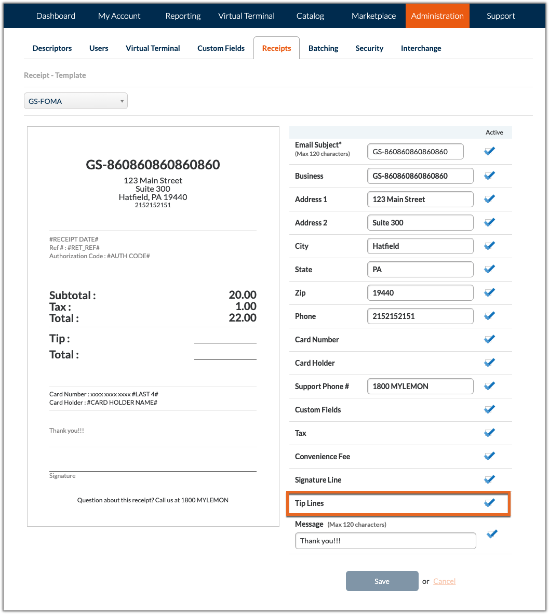

# Overview

This document provides an overview on how to best accept and process tips.

It is recommended to follow the below workflows and operations to ensure your and your customers' data remains secure.

> Some of the following workflows result in changing card-present transactions into card-not-present transactions. Due to this the rates and fees for accepting the transaction will differ. Workflows involving this change will be noted.
>
> Unless otherwise noted transactions will remain card-present.
>
> Learn more about the differences between these card-present and card-not-present transaction types by viewing our Card-Present and Card-Not-Present documentation.

# Tipping on Terminal

This workflow allows for seamlessly paying and tipping on a single terminal. This uses a single authorization on the card.

The workflow is as follows:

1. Call <code>connect</code> to establish a connection with the terminal.
2. Use <code>tip</code> to enable tipping on receipt.
3. Create an authCard request with <code>"capture" : "true"</code> to capture the transaction amount and finalize the transaction.
4. Terminate the connection with the terminal by using disconnect.

# Tipping on Receipt for Terminal Devices

The following methods result from the tip adjust setting being either enabled or disabled. Depending on this setting, the workflow will differ.

This workflow is to be used when accepting tips via a paper receipt after having already captured card information. 

## Tip Adjust Enabled

1. Call connect to establish a connection with the terminal.
2. Create an authCard request with "capture" : "true" to capture the transaction amount.
3. Terminate the connection with the terminal by using disconnect.
4. Allow the customer to fill out the tip line on the receipt
5. Use capture to add the tip amount if present otherwise original amount settles.

## Tip Adjust Disabled

> Transactions without tips will need to be captured for the original amount. These transactions will not settle by default.

1. Call connect to establish a connection with the terminal.
2. Create an authCard request with "capture" : "false" to capture the transaction amount.
3. Terminate the connection with the terminal by using disconnect.
4. Allow the customer to fill out the tip line on the receipt
5. Use capture to capture the added tipped or original amount.

# Closed Tab Tipping for CardPointe Web and Mobile Applications 

## CardPointe Mobile Procedure

> The following method results in changing the card-present transaction into a card-not-present transaction. Due to this the rates and fees for accepting the transaction will differ from card-present transactions. Learn more about card-present and card-not-present transaction types by viewing our Card-Present and Card-Not-Present documentation.

To accept immediate tips, you must first enable the **Tip At Time of Sale** setting located in the Virtual Terminal section under the **Administration** tab in the CardPointe Web Application. This will allow for both the CardPointe Mobile and CardPointe Web Applications to accept tips during a Virtual Terminal transaction.

> This procedure is only available for merchants who have the **Tip Adjust** ability. This ability can be granted to a merchant by enabling the **Tip Adjustment** Billpay Flag in CoPilot.

You must also enable the tipping ability in the CardPointe Mobile Application. To do this, navigate to the **Application** page under the **Settings** tab and enable **Restaurant-Style Gratuity**. This will result in printed receipts including two lines for the tip and the total amount after tipping for the customer to fill out.

After completing the above, the procedure for accepting tips is as follows.

1. Accept the customer's payment information via the CardPointe Mobile Device or CardPointe Mobile Application.
2. Print and provide the receipt to the customer.
3. Once the customer has filled out the tip and amount line, use the CardPointe Mobile Application to search for the transaction. To do this, navigate to the Transactions page under the Reporting tab. Then enter the retrieval reference number in the search bar and select your transaction.
4. Once your transaction is open, you can enter the amount into the Tip Adjust line and complete the transaction.

## CardPointe Web Application Procedure

> The following method results in changing the card-present transaction into a card-not-present transaction. Due to this the rates and fees for accepting the transaction will differ from card-present transactions. Learn more about the differences between these card-present and card-not-present transaction types by viewing our Card-Present and Card-Not-Present documentation.

To accept immediate tips, you must first enable the Tip At Time of Sale setting located in the Virtual Terminal section under the Administration tab in the CardPointe Web Application. This will allow for both the CardPointe Mobile and CardPointe Web Applications to accept tips during a Virtual Terminal transaction.

> This procedure is only available for merchants who have the Tip Adjust ability. This ability can be granted to a merchant by enabling the Tip Adjustment Billpay Flag in CoPilot.

To add tip lines to your receipts, navigate to the Receipts page under the Administration tab in the CardPointe Web Application and enable the Tip Lines option.

After doing this, the workflow is as follows.

1. Accept the customer's payment information.
2. Print and provide the receipt to the customer.
3. Once the customer has filled out the tip and amount line, use the CardPointe Web Application to search for the transaction. To do this, navigate to the Transactions page under the Reporting tab and enter the retrieval reference number in the search bar.
4. After selecting the desired transaction, click on the Tip Adjust button on the Transaction Detail page and enter the tip amount.

# Open Tab Workflows

There are three accepted workflows for managing a bar tab. 

## Token Retention Workflow

> Declines can occur with this workflow if the customer does not have the funds to cover the final amount.

> The following method results in changing the card-present transaction into a card-not-present transaction. Due to this the rates and fees for accepting the transaction will differ from card-present transactions. Learn more about the differences between these card-present and card-not-present transaction types by viewing our Card-Present and Card-Not-Present documentation.

1. When the bar tab is opened, use readCard to gather the card details.
2. Retain the token, expiration date, and customer name.
3. Use auth with "capture" : "N" to create a $0 authorization to validate the card details.
4. When it is time to close the tab, run a new authorization for the final amount using the token you initially obtained.

## Static Ceiling Workflow

> The following method results in changing the card-present transaction into a card-not-present transaction. Due to this the rates and fees for accepting the transaction will differ from card-present transactions. Learn more about the differences between these card-present and card-not-present transaction types by viewing our Card-Present and Card-Not-Present documentation.

1. When the bar tab is opened, use readCard to gather the card details.
2. Retain the token, expiration date, and customer name.
3. Set a ceiling for the bar tab, for example, $100.00 by running the transaction using auth with "capture" : "N".
4. If the ceiling is reached, run auth again with "capture" : "N" for a higher ceiling, $200.00 for example.
   a. If the transaction is declined, it is probably best to close the tab and open a new one with a new card.
    i. If this new auth attempt fails, close out the original tab and capture the original auth call for the final amount.
5. When the bar tab closes, capture the transaction for the final amount using capture. If the final amount is 25% higher than the initial amount ($125.00 in this example), then void the original authorization, and run auth again with "capture" : "Y" if the tip amount is included. 
  a. If there is no added tip amount, an additional step using capture would be needed to add the tip amount.

# Dynamic Ceiling Workflow

1. Set a ceiling for the bar tab by running the transaction using authCard with "capture" : "false" for a chosen amount. For example, $100.00 by running the transaction using authCard with "capture" : "false" for $100.00.
2. When the tab reaches the chosen amount from the previous step have the terminal prompt the user to retrieve the card from the customer again.
3. Run an authCard request with "capture" : "false" again for a higher ceiling, $200.00 for example. 
  a. If the transaction is declined, it is best to close the tab and open a new one with a new card.
    i. If the new authCard attempt fails, close out the original tab and capture the original authCard call for the final amount.
4. If higher ceiling authorization is approved, void the original $100.00 authorization and save the new retrieval reference number for capture later.
5. If this ceiling is reached again, do this process over again.
6. When the tab is ready to be closed, capture the most recent authorization for the final amount.
