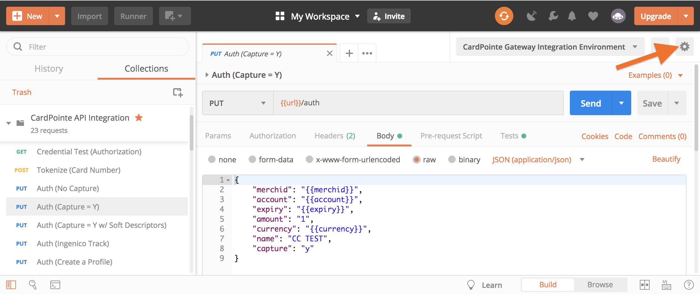

<!-- type: row -->

<!-- type: card
description: The following guides provide best practices and other supplemental information for integrating the CardPointe Gateway API.

-->

<!-- type: row-end -->

# Running the API in Postman

To help you get started with your integration, you can use the sample CardPointe Gateway API Integration Postman Collection, which includes a template of the API service endpoints.

The CardPointe Gateway API Integration collection also includes a sample Environment to help you get familiar with the API. See Configuring Your Postman Environment, below, for more information.

Click the button below to download the CardPointe Gateway API Integration collection:

[Run in Postman](https://app.getpostman.com/run-collection/b88a17df4b7a2b5667d2#?env%5BCardPointe%20Gateway%20Integration%20Environment%5D=W3sia2V5Ijoic2l0ZSIsInZhbHVlIjoie1VBVCBvciBwcm9kdWN0aW9uIHNpdGV9IiwiZW5hYmxlZCI6dHJ1ZX0seyJrZXkiOiJ1cmwiLCJ2YWx1ZSI6Imh0dHBzOi8ve3tzaXRlfX0uY2FyZGNvbm5lY3QuY29tL2NhcmRjb25uZWN0L3Jlc3QiLCJlbmFibGVkIjp0cnVlfSx7ImtleSI6ImNzdXJsIiwidmFsdWUiOiJodHRwczovL3t7c2l0ZX19LmNhcmRjb25uZWN0LmNvbS9jYXJkc2VjdXJlL2FwaS92MS9jY24vdG9rZW5pemUiLCJlbmFibGVkIjp0cnVlfSx7ImtleSI6IkF1dGhvcml6YXRpb24iLCJ2YWx1ZSI6IntBUEkga2V5fSIsImVuYWJsZWQiOnRydWV9LHsia2V5IjoiQ29udGVudC1UeXBlIiwidmFsdWUiOiJhcHBsaWNhdGlvbi9qc29uIiwiZW5hYmxlZCI6dHJ1ZX0seyJrZXkiOiJtZXJjaGlkIiwidmFsdWUiOiJ7Q2FyZENvbm5lY3QgTUlEfSIsImVuYWJsZWQiOnRydWV9LHsia2V5IjoiY3VycmVuY3kiLCJ2YWx1ZSI6IlVTRCIsImVuYWJsZWQiOnRydWV9LHsia2V5IjoiZXhwaXJ5IiwidmFsdWUiOiJ7Q2FyZCBleHBpcmF0aW9uIG5ubm59IiwiZW5hYmxlZCI6dHJ1ZX0seyJrZXkiOiJhY2NvdW50IiwidmFsdWUiOiJ7e3Rva2VufX0iLCJlbmFibGVkIjp0cnVlfSx7ImtleSI6InRva2VuIiwidmFsdWUiOm51bGwsImVuYWJsZWQiOnRydWV9LHsia2V5IjoicmV0cmVmIiwidmFsdWUiOiIiLCJlbmFibGVkIjp0cnVlfSx7ImtleSI6InByb2ZpbGVpZCIsInZhbHVlIjpudWxsLCJlbmFibGVkIjp0cnVlfSx7ImtleSI6ImFjY3RpZCIsInZhbHVlIjpudWxsLCJlbmFibGVkIjp0cnVlfSx7ImtleSI6ImJhdGNoaWQiLCJ2YWx1ZSI6bnVsbCwiZW5hYmxlZCI6dHJ1ZX0seyJrZXkiOiJkYXRlIiwidmFsdWUiOiIiLCJlbmFibGVkIjp0cnVlfV0=)

## Configuring Your Postman Environment

Environment variables allow you to autofill select fields with pre-configured values. For example, instead of manually specifying your merchant ID in the body of each request, you can set the `{{merchantid}}` variable to your specific MID.

Once you have received API credentials , you can configure the following variables to auto-fill your merchant-specific data in requests to the CardPointe Gateway API:

- **site** - Set this value to the site for the test or production environment.
- **url** - The `{{url}}` variable is used to set the base url (`https://{{site}}.cardconnect.com/cardconnect/rest/`) for the CardPointe Gateway RESTful web services. `{{site}}` is populated with the value you set for that variable.
- **csurl** - The `{{csurl}}` variable is used to set the url  (`https://{{site}}.cardconnect.com/cardsecure/api/v1/ccn/tokenize`) for the CardSecure tokenize REST web service. `{{site}}` is populated with the value you set for that variable.
- **Authorization** - Set this value to the Base64-encoded API credentials that you received. The `{{Authorization}}` variable is used in the header of every request.
- **merchid** - Set this value to your merchant ID (MID). The `{{merchid}}` variable is used in the body of most requests.

These variables are required in the header and body of most requests. The sample environment includes additional variables that you can configure when testing your integration.

Additionally, the sample collection includes test scripts, which gather specific values (such as `token`) from the response body, and dynamically update the corresponding environment variable.

To configure environment variables, do the following in Postman:

1) Click the gear icon to open the Manage Environments menu.

<!-- align: center -->

2) On the Manage Environments menu, enter your merchant-specific values for each variable.

<!-- align: center -->

3) Click **Update**

<!-- theme: warning -->
> See the [Postman user documentation](https://learning.postman.com/docs/introduction/overview/) for detailed information on using Postman to test APIs.

# Testing Your Integration

This guide provides information to help you develop and test your integrated application. Whether you are developing a new application, or maintaining an existing one, you should incorporate continuous testing in your SDLC.

